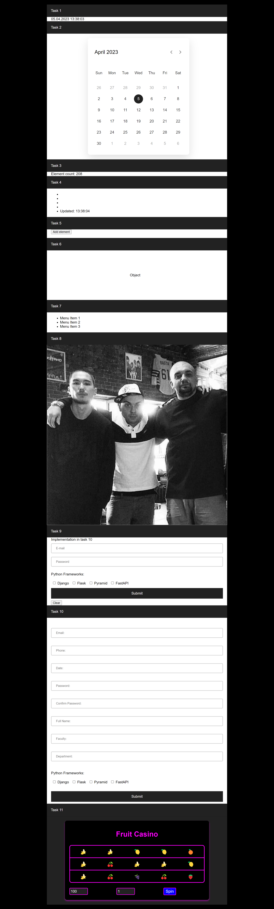

## implemented java script tasks 1-10
* all_js_tasks_1-10 
  - calendar (for task 2)
     - calendar.css 
     - calendar.js
  - src
     - img_1.png (for_task_8)
     - app_example.png
  *  1-10_tasks.js (code for tasks thanks cap)
  * accord.css (all css, for hidden and not hidden elements too)
  * main_index.html (all tasks in div blocks)
# 

## implemented flex site

# 